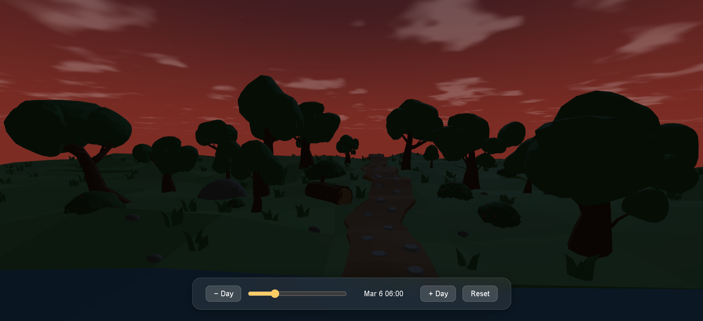
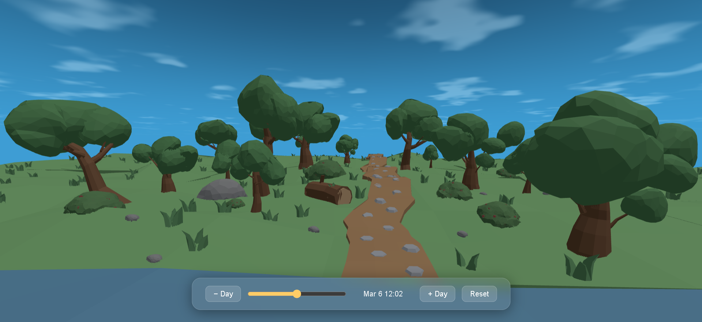
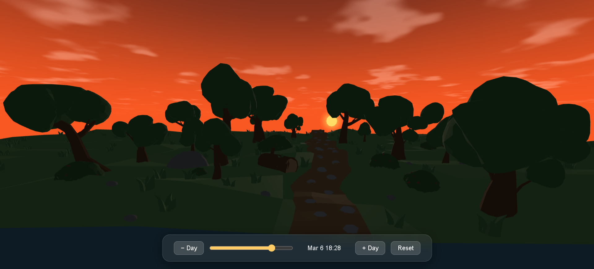
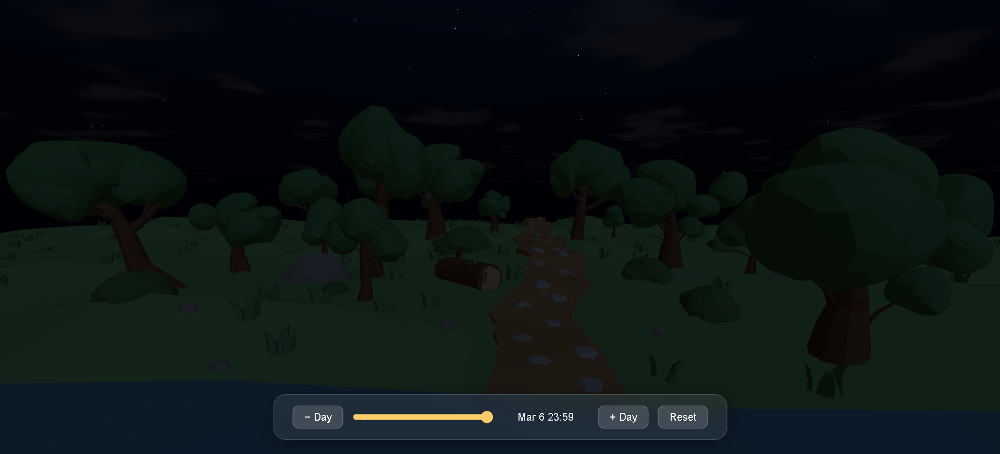

# Lowpoly Time Sync Environment

A real-time low-poly 3D environment built with **Three.js** where sky lighting, sun and moon positions, moon phases, stars, and procedural clouds all synchronize with the user's actual geographic location and time of day.

---

## What This Project Does

This website recreates the sky as it actually appears at your real-world location and time of day. It uses astronomy calculations to find the true position of the sun and moon in the sky, then renders lighting that transitions naturally between dawn, noon, dusk, and night. The moon displays its correct phase based on the current date. A time slider at the bottom of the screen lets you scrub to any hour of the day, jump forward or backward by a day, or reset to the current real-world time.

---

## Live Demo

View the project here:
https://pun1th01.github.io/lowpoly-time-sync-environment/

---

## Screenshots

### Sunrise



### Noon



### Sunset



### Night



---

## Demo

Load the page and the scene immediately reflects your current time and location:

- The sun rises and sets along the correct solar path for the user's location and date
- The sky transitions through day, sunset, twilight, and night palettes
- Stars appear at dusk, including a denser Milky Way band across the sky
- The moon renders with its correct current phase
- Procedural clouds drift slowly across the sky dome

Use the time slider at the bottom to scrub through any hour of the day, or step through days to watch moon phases and seasonal sun angles change.

---

## Features

| Feature | Description |
|---|---|
| **Real sun positioning** | SunCalc computes altitude and azimuth from GPS coordinates and the current date/time |
| **Real moon positioning** | Moon positioned using real astronomical position data from SunCalc, ensuring correct relative placement in the sky |
| **Moon phases** | Per-pixel Lambertian shader driven by the real sun–moon angle; crescent, gibbous, and full moon all render correctly |
| **Dynamic sky colours** | Four-stage altitude blend: day → sunset → twilight → night |
| **Sky gradient dome** | Inverted sphere with a zenith/horizon GLSL gradient |
| **Procedural clouds** | 3-octave FBM value noise rendered in the sky dome fragment shader; drift tied to simulation time |
| **Star field** | 6 000 candidate positions on a sphere; ~4 000 accepted with random sizes, per-vertex twinkling, and a Milky Way band density bias |
| **Geolocation** | Optional browser geolocation; falls back to Bangalore (12.97° N, 77.59° E) |
| **Time slider UI** | Glassmorphism panel; slider, ±Day buttons, and Reset |
| **Auto time advance** | Simulation clock advances 1 minute per real-world minute when the slider is idle |

---

## How It Works

### Sun & Moon Positioning

[SunCalc](https://github.com/mourner/suncalc) returns `altitude` (radians above the horizon) and `azimuth` (radians from south, westward) for any date/time/location.

These are converted to Three.js world-space Cartesian coordinates:

```
x = cos(altitude) * sin(azimuth)   // east/west
y = sin(altitude)                   // height
z = cos(altitude) * cos(azimuth)   // north/south
```

The sun and moon spheres are placed 50 000 units from the camera along their respective direction vectors, keeping them at a fixed angular size regardless of scene scale.

### Sky Gradient Shader

An inverted sphere (`THREE.BackSide`) with a custom `ShaderMaterial`. The vertex shader computes `vWorldDir = normalize(modelMatrix * position)`. The fragment shader blends `horizonColor` and `zenithColor` uniforms using `smoothstep(0.0, 0.6, vWorldDir.y)`, producing a natural atmospheric gradient. Both uniforms are updated every frame from the 4-stage sky colour system.

### 4-Stage Sky Colour System

```
altitude > 0.3 rad  →  day blue
altitude > 0.0      →  lerp to sunset orange
altitude > -0.3     →  lerp to twilight purple
altitude ≤ -0.3     →  lerp to deep night navy
```

A horizon glow (warm amber) is blended in during the ±0.1 rad window around sunrise/sunset.

### Procedural Cloud Shader

Clouds live entirely inside the sky dome fragment shader — no additional geometry. A `hash → noise → 3-octave FBM` pipeline generates soft billowy shapes. The 2D UV is projected from the world direction:

```glsl
vec2 uv = vWorldDir.xz / (vWorldDir.y + 0.05);
uv += vec2(time * 0.03, time * 0.015);
```

The `time` uniform is set from `hours * 0.05`, so clouds drift when the slider moves. Cloud colour is white in daylight, warm during sunset, and suppressed at night via a luminance check on `zenithColor`.

### Moon Phase Shader

The moon sphere uses a `ShaderMaterial`. The vertex shader transforms normals with `normalMatrix` (producing view-space normals). Each frame, the world-space vector from moon to sun is transformed into view space and passed as the `sunDirection` uniform. The fragment shader computes:

```glsl
float brightness = smoothstep(-0.05, 0.25, dot(N, L));
vec3 finalColor  = moonColor * (brightness + 0.12); // 0.12 = earthshine
```

This produces correct crescent, quarter, gibbous, and full moon appearances as the sun–moon angle changes across the synodic month.

### Star Field

6 000 candidate positions are distributed uniformly on a sphere. Acceptance probability is biased by a Gaussian function of the equatorial distance, producing a denser band — the Milky Way. Per-star size, brightness, and twinkle phase are stored as custom attributes and consumed in a `ShaderMaterial` points renderer. Stars fade in during the `-0.1` to `-0.25` rad twilight window.

### Time Synchronization

`setInterval` fires every 60 seconds and advances `simulationTime` by one minute, then calls `refreshSun()`. A `userControllingTime` flag suppresses this while the slider is being dragged, and resets automatically 10 seconds after the last interaction.

---

## Technologies

- [Three.js r160](https://threejs.org/) — 3D rendering, shaders, shadows
- [SunCalc 1.9.0](https://github.com/mourner/suncalc) — astronomical sun/moon calculations
- [GLTFLoader](https://threejs.org/docs/#examples/en/loaders/GLTFLoader) — low-poly scene model
- Vanilla ES modules — no build step required
- [Blender](https://www.blender.org/) — all environment assets were modeled and textured manually in Blender and exported as GLB files for efficient rendering on the web

---

## Installation

No npm, no build step — just a static file server.

**Prerequisites:** Python 3 (or any static file server)

```bash
# Clone the repository
git clone https://github.com/pun1th01/lowpoly-time-sync-environment.git
cd lowpoly-time-sync-environment

# Start a local server
python -m http.server 8080

# Open in browser
http://localhost:8080
```

> **Why a server?** Three.js ES modules and GLB loading require an HTTP context; opening `index.html` directly via `file://` will not work.

---

## Controls

| Control | Action |
|---|---|
| **Time slider** | Scrub to any minute of the current day |
| **− Day** | Step back one calendar day |
| **+ Day** | Step forward one calendar day |
| **Reset** | Return to the current real-world time |
| *(idle)* | Scene auto-advances 1 min per real-world minute |

---

## Project Structure

```
lowpoly-time-sync-environment/
│
├── index.html          # Entry point — imports, SunCalc script tag
├── script.js           # All Three.js scene logic
│
├── assets/
│   ├── models/
│   │   └── scenery.glb     # Low-poly landscape (GLTF binary)
│   └── screenshots/        # Repository screenshots
│
├── README.md
├── LICENSE
└── .gitignore
```

---

## Future Improvements

- [x] Mobile support — responsive layout and touch-friendly slider controls for phones and tablets
- [ ] Physically-based atmosphere — Rayleigh/Mie scattering for more accurate sunset colours
- [ ] Visual improvements — enhanced cloud detail, softer star glow, and smoother horizon blending
- [ ] Visual fixes — reduce sky banding at night, improve moon glow intensity scaling at different phases

---

## License

MIT — see [LICENSE](LICENSE) for details.
