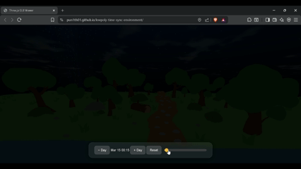
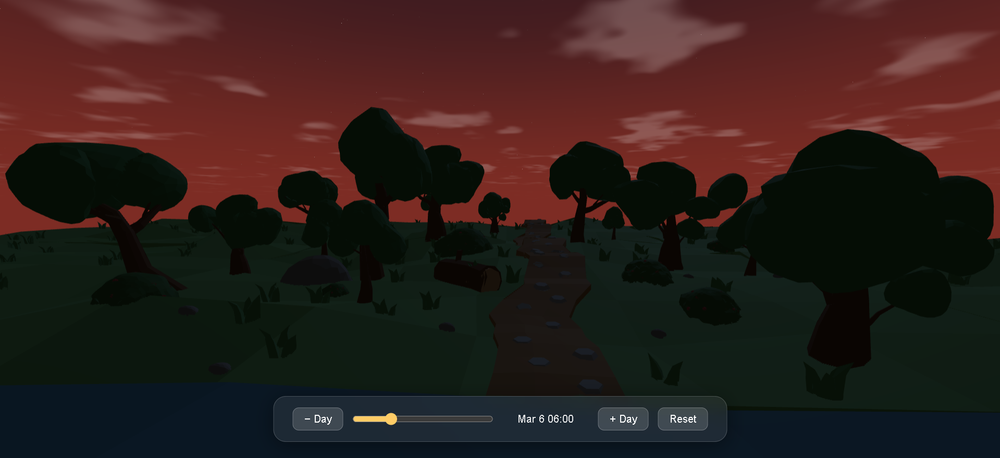
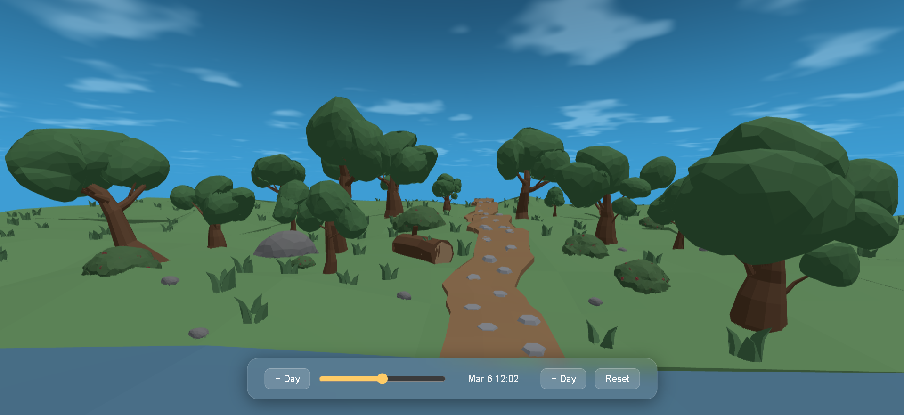
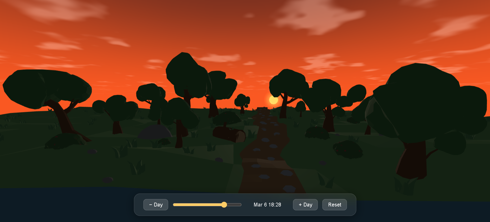
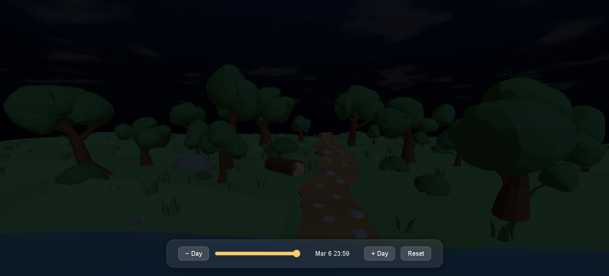

# Lowpoly Time Sync Environment

A real-time, astronomy-driven 3D sky simulation that reproduces the sky for a user's location and time, including solar/lunar motion, moon phase, stars, and a multi-layer Milky Way.

Built with Three.js and custom GLSL shaders, this project combines physically grounded celestial math with production-style interaction design to deliver a technically rich, interactive day-night experience.

Unlike most portfolio sky demos, this system ties visual fidelity directly to real astronomical state and sidereal rotation rather than a scripted lighting loop.

## Overview

Lowpoly Time Sync Environment reconstructs how the sky should appear at a specific latitude, longitude, date, and time.

It uses SunCalc for solar/lunar astronomy, custom shader systems for sky and clouds, and a multi-layer celestial pipeline for stars and the Milky Way. Users can run in real time or scrub across hours and dates to inspect twilight behavior, moon phases, and sidereal sky rotation.

## Key Features

### Astronomical Accuracy

- Real sun and moon positioning from SunCalc altitude/azimuth outputs.
- Local-time and location-aware sky simulation with geolocation fallback.
- Moon phase rendering driven by real sun-moon geometry and illumination data.
- Celestial sphere rotation aligned with local sidereal time.

### Visual Rendering Systems

- Four-stage sky color model: day, sunset, twilight, night.
- GLSL sky dome gradient with warm horizon transitions at sunrise/sunset.
- Procedural cloud layer (FBM noise) inside the sky shader.
- Three-layer Milky Way system:
  - star points (density-biased galactic band),
  - dust blobs,
  - volumetric haze sphere.
- Twilight-aware star and nebula fade-in using altitude-linked visibility curves.

### Interaction and Time Controls

- Time slider for minute-level scrubbing.
- Day step controls (`- Day`, `+ Day`) and reset to real time.
- Automatic simulation progression (1 simulated minute per real minute) when idle.
- User-local time and selected-city time shown side-by-side.

### Location and Timezone Support

- Optional browser geolocation.
- Manual multi-city selection (curated dataset) with timezone-aware switching.
- Reset flow back to geolocation context.
- Fallback default location when geolocation is unavailable.

### UI Improvements

- Mobile-optimized bottom-sheet controls with touch-friendly interactions.
- Adaptive dropdown and calendar positioning to prevent clipping on small viewports.
- Polished calendar/dropdown interaction model with stable layering and clear location feedback overlays.

## Demo / Screenshots

### Live Demo

[Launch Live Demo](https://pun1th01.github.io/lowpoly-time-sync-environment/)

Best viewed on desktop first, then mobile, to compare full-scene framing and bottom-sheet controls.

### Full Day Cycle



### Scene Snapshots

**Sunrise**


**Noon**


**Sunset**


**Night**


## How It Works

### 1) Sun and Moon World-Space Positioning

SunCalc returns altitude and azimuth, converted to Three.js world-space direction vectors:

```text
x = cos(altitude) * sin(azimuth)
y = sin(altitude)
z = cos(altitude) * cos(azimuth)
```

Sun and moon meshes are placed at a fixed large radius from the camera to preserve angular behavior independent of scene scale. Moon opacity is faded near the horizon using a shader uniform.

### 2) Sky Gradient and Atmospheric Color Model

An inverted sphere (`THREE.BackSide`, radius 75,000) uses a custom `ShaderMaterial`.

- Vertex shader computes normalized world direction.
- Fragment shader blends horizon and zenith colors with `smoothstep`.
- Per-frame uniforms are driven by sun altitude.

Sky stages:

```text
altitude > 0.3 rad  -> day
altitude > 0.0      -> sunset blend
altitude > -0.3     -> twilight blend
altitude <= -0.3    -> night blend
```

A warm horizon glow is introduced within the sunrise/sunset transition window.

### 3) Procedural Cloud Shader

Clouds are fully shader-based (no extra geometry), generated through `hash -> noise -> 3-octave FBM`.

```glsl
vec2 uv = vWorldDir.xz / (vWorldDir.y + 0.05);
uv *= 2.0;
uv += vec2(time * 0.3, time * 0.15);
```

`time` is tied to both real time and simulation offset, so slider changes visibly move cloud patterns.

### 4) Moon Phase Shader

Moon shading is computed from the view-space normal and a sun direction uniform:

```glsl
float brightness = smoothstep(-0.05, 0.25, dot(N, L));
vec3 finalColor  = moonColor * (brightness + 0.12); // earthshine term
```

This supports crescents, quarter, gibbous, and full phases. `SunCalc.getMoonIllumination()` also controls moon glow intensity.

### 5) Star Field and Milky Way Pipeline

Star field:

- Up to ~18,000 stars on a sphere (radius 80,000).
- Rejection sampling for uniform angular distribution.
- Gaussian density bias for a visible galactic band (~4x local concentration).
- Per-star attributes include size, brightness, twinkle phase, and color tint.

Milky Way layers (additive):

1. Star points (`starVisibility`).
2. Dust blobs (~2,200 points) concentrated near galactic latitude with opacity bias near core longitude.
3. Haze sphere (inverted shell) using Gaussian band shaping and 4-octave FBM for continuous glow.

### 6) Celestial Sphere Orientation and Sidereal Time

A three-level hierarchy avoids orientation artifacts:

```text
latitudeGroup (rotation.x = pi/2 - lat)
  -> skyGroup (rotation.y = LST * pi/12)
    -> starGroup (rotation.z = 0.6)
```

Local sidereal time is computed from simulation timestamp:

```js
const d = (simulationTime - Date.UTC(2000, 0, 1, 12)) / 86400000;
const GMST = 18.697374558 + 24.06570982441908 * d;
const LST = ((GMST + longitude / 15) % 24 + 24) % 24;
skyGroup.rotation.y = LST * Math.PI / 12;
```

Separating sidereal rotation and galactic tilt across nested groups preserves correct transform order and prevents mirrored Milky Way orientation.

### 7) Twilight Visibility Coupling

```js
const starVis = clamp((-altitude - 0.1) / 0.15, 0, 1);
const nebulaVisibility = Math.pow(starVis, 1.5);
```

Stars appear first; dust and haze fade in more gradually, improving perceived realism during twilight.

### 8) Lighting and Simulation Sync

Lighting model:

- `DirectionalLight` for sun (shadow casting, daylight-scaled intensity).
- `DirectionalLight` for moon fill (`sin(moonAltitude)`-based intensity).
- Ambient and sky-scattered fill lights for shadow readability.

Time model:

- Auto-advance every 60 seconds when idle.
- User interaction pauses auto-advance for 10 seconds.

## Tech Stack

- Three.js r160 - real-time 3D rendering, scene graph, lighting, and shadow pipeline
- GLSL (custom shaders) - sky gradient, procedural FBM clouds, moon phase shading, star/dust/haze rendering
- SunCalc 1.9.0 - solar/lunar position and moon illumination calculations
- GLTFLoader - low-poly environment asset loading (`.glb`)
- Vanilla ES modules - browser-native architecture with no build step
- Blender - asset modeling, texturing, and export workflow

## Usage

### Run Locally

```bash
git clone https://github.com/pun1th01/lowpoly-time-sync-environment.git
cd lowpoly-time-sync-environment
python -m http.server 8000
```

Open: `http://localhost:8000`

Three.js modules and GLB loading require an HTTP server context.

### Practical Notes

- Geolocation requires a secure context in most browsers (`https://` or `http://localhost`).
- The app currently uses a curated city list (17 cities), not an open-ended search database.
- Calendar year selection is currently constrained to `2000-2035`.
- Runtime dependencies are loaded from CDNs (Three.js and SunCalc), so internet access is required unless self-hosted.

### Controls

| Control | Action |
|---|---|
| Time slider | Scrub to any minute of the selected day |
| `- Day` | Move back one calendar day |
| `+ Day` | Move forward one calendar day |
| Reset | Return to current real-world time |
| Idle mode | Auto-advance 1 min per real-world minute |

## Architecture / Project Structure

```text
lowpoly-time-sync-environment/
├── index.html              # Entry point and script imports
├── script.js               # Core Three.js, shaders, astronomy, UI logic
├── assets/
│   ├── gif/
│   │   └── transition.gif
│   ├── models/
│   │   └── scenery.glb
│   └── screenshots/
├── README.md
└── LICENSE
```

`script.js` high-level layout:

- Scene/camera/renderer bootstrap.
- Global simulation state and timing.
- Lighting system.
- Sky dome and cloud shaders.
- Sun/moon meshes and moon phase shader.
- Star field + Milky Way generation.
- Astronomical update loop (`updateSunPosition`, `refreshSun`).
- Geolocation/city/timezone control flow.
- Time UI, animation loop, resize handling.

## Performance Considerations

- Adaptive star density scales with detected GPU capability.
- Shader-based clouds avoid additional draw calls from cloud geometry.
- Star and dust systems use `BufferGeometry` attributes for efficient batched rendering.
- Visibility gating (`starVisibility`, `nebulaVisibility`) limits expensive night-sky effects during bright daylight.
- Responsive FOV adaptation preserves composition on narrow/portrait viewports without extra scene complexity.

## Future Improvements

- Expand location exploration workflow with richer region/city discovery UX.
- Add more advanced date-navigation tooling for seasonal and long-range sky studies.
- Introduce optional atmospheric scattering refinement for higher-fidelity twilight gradients.
- Add lightweight instrumentation overlays (FPS, draw calls, quality level) for tuning on low-end devices.

## License

MIT - see [LICENSE](LICENSE).
